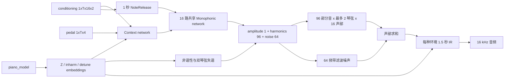

# 当前网络结构与实时性审查

审查日期：2026-07-21

版本说明：本文所称“当前模型”从 2026-07-23 起正式记为 **v1**；
`piano_current_fixed.onnx` 仅作为兼容文件名保留。v2 是独立结构实验，详见
[模型版本命名与 v2 音质分析](model-versions.md)。

## 结论

| 问题 | 结论 |
|---|---|
| 网络能否学习 MAESTRO 钢琴音色 | 可以。结构保留了旧版 DDSP-Piano 的复音、非谐性、双琴弦失谐、滤波噪声和多环境混响建模。 |
| 神经网络能否按实时小块运行 | 可以作为候选。ONNX 每次处理 1 个 250 Hz 控制帧，并显式输入、输出两组 GRU 状态。 |
| 当前工程能否直接连续输出无爆音音频 | 不可以。导出的 ONNX 只输出控制量，宿主端连续 DSP 和实时 MIDI 引擎尚未实现。 |
| 是否已经达到 DDSP-VST 类似的完整实时能力 | 尚未。模型边界相似，但缺少音频线程、后台推理、环形缓冲、重采样和状态化 C++ DSP。 |
| 是否已经可以部署到 Ascend 310B | 尚不能确认。当前只完成 CPU PyTorch/ONNX Runtime 等价验证，本机没有 CANN、ATC 或 310B 真机验证环境。 |

因此，当前状态应定义为“实时神经控制器原型已成立，端到端实时乐器尚未完成”。

这里的 Ascend 结论只针对当前 16 声部钢琴 ONNX。项目已经实测 DDSP-VST 模型可以直接转换为 OM，在该已测试模型和转换配置范围内不存在模型适配风险；但当前模型增加了第二组 GRU、Embedding/Gather、16 声部状态、钢琴非谐性和不同输出合同，仍需单独验证。三套模型的逐层差异见 [DDSP 网络结构对比](ddsp-network-structure-comparison.md)。

## 数据与训练输入

默认预处理合同定义在 [`PreprocessConfig`](../ddsp_piano/maestro.py#L28)：

- 音频：单声道 FP32，16 kHz。
- 控制帧率：250 Hz，即每帧对应 64 个音频采样、4 ms。
- 训练片段：3 秒，即 48,000 个采样和 750 个控制帧。
- 片段重叠：50%。
- 最大复音数：16。
- MIDI 条件：每个声部包含 `pitch` 和仅在起音帧出现的归一化 `onset_velocity`。
- 踏板条件：CC64 至 CC67，共 4 维；只有 CC64 在预处理阶段参与延音状态计算，其余控制器作为网络输入。
- 音色编号：MAESTRO 的 10 个年份映射为 10 个 `piano_model` 索引。它是录音年份/环境代理，不是严格的物理钢琴型号标识。

音符按稳定槽位写入 `[T,16,2]`，延续音符尽量保留原槽位。超过 16 复音的 3 秒片段会被整个排除，见 [`MaestroSegmentDataset`](../ddsp_piano/maestro.py#L356)。这与上游 DDSP-Piano 的训练策略一致，但实时宿主仍需定义超过 16 键时的声部窃取规则。

## 当前网络结构



### 全局上下文网络

[`ContextNetwork`](../ddsp_piano/modules/sub_modules.py#L13) 在每个控制帧把 16 个声部的 MIDI 条件展平为 32 维，再拼接 4 维踏板和 16 维钢琴嵌入：

```text
52 -> Linear(32) -> LeakyReLU -> GRU(64) -> LayerNorm -> Linear(32)
```

这一路径让每个单音声部感知整体和弦、踏板和钢琴类别。实时接口显式携带 `[1,1,64]` 的 GRU 状态。

### 单音控制网络

[`MonophonicNetwork`](../ddsp_piano/modules/sub_modules.py#L231) 的参数在 16 个声部之间共享。每一路输入为：

```text
extended_pitch(1) + conditioning(2) + context(32) = 35
35 -> Linear(128) -> LeakyReLU -> GRU(192)
   -> Linear(192) -> LeakyReLU -> LayerNorm -> Linear(161)
```

161 维输出拆分为：

- 总谐波幅度：1。
- 部分音分布：96。
- 噪声频响：64。

实时接口为每个槽位携带一份 GRU 状态，合同为 `[1,16,192]`。

### 物理先验与合成器

- [`InharmonicityNetwork`](../ddsp_piano/modules/sub_modules.py#L124) 用高音桥和低音桥的参数曲线计算钢琴弦非谐性系数。
- [`Detuner`](../ddsp_piano/modules/sub_modules.py#L192) 在第二训练阶段为每个音高产生最多 2 个略微失谐的琴弦基频。
- [`MultiInharmonic`](../ddsp_piano/modules/inharm_synth.py#L144) 为每个琴弦生成 96 个部分音，再在 16 个声部间求和。
- [`Noise`](../ddsp_piano/ddsp_pytorch/noise.py#L7) 用 64 维频响过滤宽带噪声。
- [`MultiInstrumentReverb`](../ddsp_piano/modules/sub_modules.py#L426) 为 10 个 MAESTRO 年份各学习一条 24,000 点、1.5 秒的 IR。

当前配置共有 521,507 个参数，其中混响 IR 占 240,000 个参数。第一阶段训练 521,474 个参数；第二阶段只训练 33 个调律和非谐性相关参数。16 声部共享神经网络权重，因此参数量不会随声部数线性增长，但 DSP 工作量会随声部数、琴弦数和有效部分音数增长。

## ONNX 实时合同

[`PianoRealtimeControlModel`](../ddsp_piano/deployment.py#L28) 只导出神经控制路径，不导出 FFT 噪声和卷积混响。默认合同为固定 batch、固定 1 帧、FP32、opset 13。

### 输入

| 名称 | 形状 | 类型 | 所有者 |
|---|---:|---|---|
| `conditioning` | `[1,1,16,2]` | FP32 | MIDI 调度器/声部分配器 |
| `pedal` | `[1,1,4]` | FP32 | MIDI 调度器 |
| `piano_model` | `[1]` | INT32 | 音色预设 |
| `extended_pitch` | `[1,1,16,1]` | FP32 | 宿主端 release 状态机 |
| `context_state` | `[1,1,64]` | FP32 | 上一次 ONNX 输出 |
| `monophonic_state` | `[1,16,192]` | FP32 | 上一次 ONNX 输出 |

### 输出

| 名称 | 形状 | 说明 |
|---|---:|---|
| `amplitudes` | `[1,1,16,1]` | 未缩放总幅度 |
| `harmonic_distribution` | `[1,1,16,96]` | 未缩放部分音分布 |
| `inharmonicity` | `[1,1,16,1]` | 非谐性系数 |
| `f0_hz` | `[1,1,16,2]` | 第二阶段模型的双琴弦基频 |
| `noise_magnitudes` | `[1,1,16,64]` | 未缩放噪声频响 |
| `reverb_ir` | `[1,24000]` | 当前音色的静态混响 IR |
| `next_context_state` | `[1,1,64]` | 下一帧状态 |
| `next_monophonic_state` | `[1,16,192]` | 下一帧状态 |

第一阶段模型禁用双琴弦失谐，因此其临时导出物的 `f0_hz` 最后一维为 1；最终第二阶段合同才是 2。宿主必须从最终导出物旁的 JSON 读取合同，不能根据临时 smoke 模型推断形状。

## 已验证的部分

当前 smoke ONNX 为 1,238,082 字节、138 个节点，包含 2 个 ONNX `GRU` 节点，没有动态维度、FFT、STFT 或随机算子。4 个连续状态帧的 PyTorch CPU 与 ONNX Runtime 最大绝对误差为 `1.0729e-6`。

在本机训练同时运行时，对 smoke 神经控制器做了 1,000 次 ONNX Runtime CPU 调用，得到以下非实时调度基准：

| 指标 | 单帧耗时 |
|---|---:|
| 平均 | 0.166 ms |
| P50 | 0.091 ms |
| P95 | 0.102 ms |
| P99 | 3.094 ms |
| 最大 | 9.098 ms |

平均值明显低于 4 ms 控制周期，说明神经部分体量合理；但最大值已经超过周期，而且该测试不含 MIDI、NPU 传输、完整 DSP、重采样和音频回调，不能作为硬实时或 Ascend 性能结论。

## 阻止完整实时合成的问题

### P0：宿主端实时音频引擎不存在

仓库目前没有把 MIDI 回调、16 声部分配、ONNX/CANN 推理、DSP 合成和声卡输出串起来的生产运行时。Python 的 [`extend_pitch_for_release`](../ddsp_piano/deployment.py#L60) 和 [`scale_controls_for_synthesis`](../ddsp_piano/deployment.py#L92) 只是参考实现，不是实时 C++ 音频路径。

### P0：DSP 没有跨音频块状态

现有 [`HarmonicOscillator`](../ddsp_piano/ddsp_pytorch/harmonic_oscillator.py#L42) 在每次调用时从零开始 `cumsum` 相位。如果按 64 采样块直接重复调用，相位会在块边界重置并产生咔嗒或频谱泄漏。

现有噪声合成没有保留 FIR overlap；现有 [`Reverb`](../ddsp_piano/ddsp_pytorch/reverb.py#L8) 对整段音频做 FFT 卷积，也没有保留卷积尾音。三者都必须实现宿主端流式状态，不能把离线训练 DSP 逐块调用当成实时实现。

### P0：Ascend 310B 兼容性尚未验证

当前环境找不到 `atc`、`npu-smi`、`ais_bench` 或 `/usr/local/Ascend`。ONNX 图中的关键风险包括 `GRU`、`Gather`、`Where`、`Tile`、`Expand` 以及 INT32 到 INT64 的 `Cast`。在目标 CANN 版本完成 ATC 转换、算子落图、内存和真机时延测试前，只能称为 ONNX Runtime 兼容。

这不否定 DDSP-VST 的 OM 实测结果。DDSP-VST 是单个 512 维状态、50 Hz、`1 + 60 + 65` 输出的较小控制器，且其循环图可以分解为基础门控算子；当前钢琴模型是两组 GRU、250 Hz、16 声部和不同控制维度的另一张图。若当前 ONNX `GRU` 适配失败，可优先沿用 DDSP-VST 已验证的 `MatMul/Add/Sigmoid/Tanh/Mul` 展开方式，而不是更改钢琴模型功能。

### P1：验证集采样不足以可靠选择最佳权重

训练脚本固定 `shuffle=False` 创建验证 loader，并且流水线每轮只验证前 16 个 batch。batch size 为 1 时，这通常只是同一首曲目前部的 16 个重叠片段，约 48 秒音频，不能代表完整验证集。当前 `best.pt` 的选择因此可能受曲目和片段偏差影响。

应改为固定且可复现的跨曲目均衡验证子集，至少覆盖多个年份、曲目、力度、踏板和复音区间；最终评估还应覆盖完整 MAESTRO validation/test。

### P1：评估噪声在声部间完全相关

[`Noise.forward`](../ddsp_piano/ddsp_pytorch/noise.py#L13) 在训练模式为每个声部生成独立随机噪声，但在 `eval()` 下每次都从同一采样索引生成同一确定性序列。模型逐声部调用噪声模块，因此 16 路验证噪声相位完全一致，会发生相干叠加，训练和验证分布不一致，也不符合实时宿主中独立噪声源的预期。

建议使用可复现但按 batch、声部和连续块区分的 PRNG 状态，并增加跨块连续性测试。

### P1：第二训练阶段不应自动视为更好

当前无人值守流程在第一阶段 40,000 步后固定执行第二阶段 5,000 步，并最终导出第二阶段最佳点。官方 DDSP-Piano v2 明确说明第二阶段的可微振荡器频率优化通常不改善听感，推荐单阶段训练。

当前流程可以继续完成，但交付时必须同时保留并试听比较 `phase1/best.pt` 和 `phase2/best.pt`。只有当跨曲目指标和盲听都改善时，才采用第二阶段模型。

### P1：每 4 ms 输出一次 24,000 点 IR

`reverb_ir` 只在 `piano_model` 改变时需要更新，却被放在每帧 ONNX 输出中。FP32 下每次约 96 KB，250 Hz 时约产生 24 MB/s 的无效输出流量，并增加设备同步成本。

应把静态音色数据拆成“切换预设时调用一次”的初始化模型或宿主资源；高频控制模型只输出每帧变化的张量。

### P1：没有启动、重置和故障恢复语义

官方 DDSP-Piano 离线推理提供循环层 warm-up。当前实时合同可以传入零状态，但没有规定插件启动、切换钢琴、MIDI panic、设备掉线、宿主采样率变化和模型推理超时后如何清理 GRU、相位、噪声、混响和声部分配状态。

### P2：16 kHz 是部署折中，不是高保真终点

16 kHz 将可表达频率限制在 8 kHz。它降低了 310B 端算力和带宽，但会丢失钢琴击弦瞬态和高次泛音。官方 v2 默认 24 kHz，常见插件宿主为 44.1/48 kHz。建议先以 16 kHz 完成 310B 闭环，再对 24 kHz 变体重新检查模型尺寸、DSP 工作量、重采样质量和端到端时延，不能只修改一个采样率常量。

### P2：音色质量仍缺少验收证据

现有测试覆盖张量合同、带限、release 状态和 PyTorch/ONNX 数值等价，但没有覆盖：

- 完整序列与逐帧状态推理的一致性。
- 跨块相位、噪声和混响连续性。
- 16 声部与踏板压力场景。
- 实时因子、P99/P99.9 抖动和 underrun。
- MAESTRO test 指标、固定 MIDI 回归音频和盲听比较。

训练完成不等于实时和音质验收完成。

## 最终判断

当前网络规模、固定形状和显式 GRU 状态使其有较高概率实现实时神经控制推理；当前 ONNX 边界也比把 FFT/STFT 强行塞入 Ascend 图更稳妥。真正的工程风险已经从“神经网络是否太大”转移到“宿主端连续 DSP、调度抖动、验证质量和 CANN 算子支持”。完成这些部分后，才能把它称为实时钢琴合成器。
