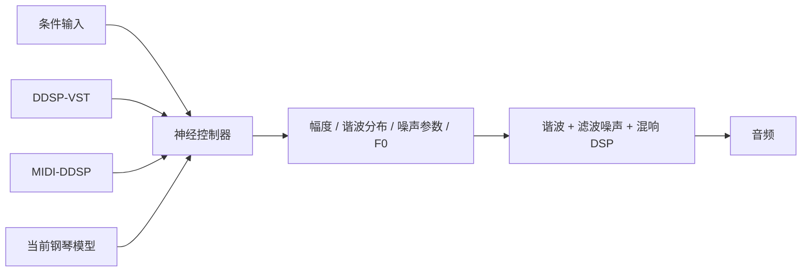

# DDSP、DDSP-VST、MIDI-DDSP 与当前钢琴模型结构对比

审查日期：2026-07-21

## 结论

DDSP 不是一种固定神经网络，而是一套“神经控制器 + 可微数字信号处理器”的建模方法。网络负责从音高、响度、MIDI 或潜变量预测可解释的合成参数，DSP 再用谐波振荡器、滤波噪声和混响生成音频。因此，DDSP-VST、MIDI-DDSP 和当前钢琴模型都属于 DDSP，但它们的神经控制器结构、时间合同和实时性明显不同。

项目已经实测 DDSP-VST 模型可以直接转换为 OM。本文将该结构记为 Ascend 310B 的已验证兼容基线，在已测试模型和转换配置范围内不再把 OM 适配视为风险。该结论不能自动外推到 MIDI-DDSP 或当前钢琴模型，因为后两者的算子、状态、输入输出和序列执行方式均不同。

三者的直接关系是：



共同点主要在右侧的 DDSP 合成思想，不代表左侧神经网络相同。

## DDSP 的通用结构

Google DDSP 的典型自动编码器由以下部分组成：

1. 预处理或编码器从音频或控制输入得到 `f0`、响度和可选潜变量 `z`。
2. 解码器使用全连接层、GRU、卷积或其他时序网络预测合成控制量。
3. `Harmonic`、`FilteredNoise` 和 `Reverb` 等可微 DSP 模块把控制量变成音频。
4. 训练时使用多尺度频谱损失比较合成音频和目标音频。

所以“DDSP 采用哪种网络”没有单一答案。经典单音模型常用 `RnnFcDecoder`，但 MIDI-DDSP 使用了双向 GRU、自回归 GRU 和扩张卷积，DDSP-Piano 又使用了全局上下文网络与逐声部共享网络。选择网络的依据是输入条件、音色、因果性和部署目标，而不是 DDSP 框架强制指定某种层。

## DDSP-VST 的网络

DDSP-VST 的神经部分是一个较小的因果 `RnnFcDecoder`。配置见 [`vst.gin`](../references/google-ddsp/ddsp/training/gin/models/vst/vst.gin#L36)，实现见 [`RnnFcDecoder`](../references/google-ddsp/ddsp/training/decoders.py#L27)：

```text
f0_scaled [1]
  -> FC stack: 1 -> 256

pw_scaled [1]
  -> FC stack: 1 -> 256

concat [512]
  -> GRU(512)

concat [f0 features, power features, GRU output]
  -> FC stack: 1024 -> 256
  -> Dense(126)
  -> amplitude(1) + harmonic_distribution(60) + noise_magnitudes(65)
```

流式推理通过 [`VSTStatelessPredictControls`](../references/google-ddsp/ddsp/training/inference.py#L301) 显式输入、输出一个 512 维 GRU 状态。宿主常量见 [`Constants.h`](../references/ddsp-vst/src/util/Constants.h)：

- 16 kHz 模型采样率。
- 50 Hz 控制帧率。
- 320 个采样的 hop，即每 20 ms 推理一次。
- 输入为缩放后的 F0、功率和上一帧状态。
- 输出为 1 个总幅度、60 个谐波权重、65 个噪声系数和下一状态。
- 每套模型对应一个训练好的音色，不使用多乐器嵌入。

它适合实时部署的原因不只是网络小，还包括显式状态和成熟宿主边界：模型在后台定时线程推理，音频线程通过环形缓冲取数据，C++ DSP 保存相位并连续生成音频。

DDSP-VST 的 MIDI synth 路径只维护一个当前音符和一套 ADSR，本质上是单音模型。它的 OM 转换已经由项目实测通过，但要做实时钢琴仍需要另行实现复音声部分配、踏板和多声部 DSP。

## MIDI-DDSP 的默认网络

MIDI-DDSP 不是在 DDSP-VST 前面简单增加一个 MIDI 输入。默认配置由 [`hparams_synthesis_generator.py`](../references/midi-ddsp/midi_ddsp/hparams_synthesis_generator.py#L35) 定义，采用 `interpretable_conditioning + rnn_synth_params`，包含“音符级表情生成”和“逐帧合成参数生成”两层模型。

### 音符级表情生成器

[`ExpressionGenerator`](../references/midi-ddsp/midi_ddsp/modules/expression_generator.py#L39) 的输入是完整音符序列：

```text
MIDI pitch -> Embedding(128, 64)
note length -> Dense(64)
instrument id -> Embedding(20, 64)
concat -> Bidirectional GRU(128)
       -> autoregressive GRU(128)
       -> autoregressive GRU(128)
       -> 2-layer FC output
       -> 6 note-level expression controls
```

六个控制量为：

```text
volume, vol_fluc, vibrato, brightness, attack, vol_peak_pos
```

双向 GRU 会读取未来音符，两层条件 GRU 又按音符自回归生成，因此原实现面向离线乐句生成，不是零前视实时网络。

### 逐帧合成参数生成器

默认 [`ExpressionMidiDecoder`](../references/midi-ddsp/midi_ddsp/modules/midi_decoder.py#L48) 将六个表情控制、MIDI pitch、onset、offset 和音符内相对位置送入 5 层全连接预处理网络，产生 256 维条件，再拼接 64 维乐器嵌入。

默认 [`MidiToSynthAutoregDecoder`](../references/midi-ddsp/midi_ddsp/modules/synth_params_decoder.py#L454) 分成两条支路：

```text
F0 支路:
  condition -> Bidirectional GRU(256)
            -> autoregressive GRU(256)
            -> autoregressive GRU(256)
            -> 201-bin relative-F0 logits
            -> top-p categorical sample -> f0_hz

合成参数支路:
  condition + predicted F0 embedding
            -> DilatedConvStack(ch=128,
                                layers_per_stack=5,
                                stacks=4)
            -> amplitude(1) + harmonics(60) + noise(65)
```

默认参数为 16 kHz、每帧 64 个采样，即 250 Hz 或 4 ms 控制周期；训练序列长度为 1,000 帧。虽然控制率比 DDSP-VST 更高，但双向上下文、Python 全序列循环、随机 categorical 采样和更大的分层网络使默认模型不能直接作为实时 OM 控制器。

MIDI-DDSP 的单个 synthesis generator 面向单音乐器。示例中的四重奏是将多个单音乐部独立合成后混音，不是一个网络内部同时处理和共享上下文的原生复音模型。

## 与 DDSP-VST 的区别

| 项目 | DDSP-VST | MIDI-DDSP 默认模型 |
|---|---|---|
| 目标 | 实时音频音色迁移/单音 MIDI synth | 从乐谱生成带表情的乐器演奏 |
| 输入 | 每帧 F0、功率、GRU 状态 | 音符序列、乐器 ID、MIDI 帧和表情控制 |
| 主网络 | 两个 FC 输入栈 + 单层 GRU(512) + FC | 表情 BiGRU/双 GRU + F0 BiGRU/双 GRU + 扩张卷积 |
| 因果性 | 因果，显式单状态 | 默认非因果，并含全序列自回归 |
| 推理随机性 | 无 | F0 默认使用 top-p/random categorical sampling |
| 控制帧率 | 50 Hz，20 ms hop | 250 Hz，4 ms hop |
| 输出 | `1 + 60 + 65` 和下一状态 | F0 加 `1 + 60 + 65`，并有中间表情层 |
| 多音色 | 一套权重对应一种音色 | 乐器 embedding，代码预留 20 个 ID |
| 复音 | 单个模型单音 | 单个模型单音；多乐部通过多次合成后混音 |
| 实时就绪程度 | 最高，已有 VST 宿主；项目已验证可转 OM | 默认结构需要因果化和静态图改造 |

二者最终都预测谐波加滤波噪声所需的控制量，所以 DSP 端可以共享很多算法。但网络权重、输入合同、循环状态和执行顺序不兼容，不能互换模型，也不能用 DDSP-VST 的 OM 成功直接证明 MIDI-DDSP 可转 OM。

## 当前钢琴模型是第三种结构

当前工程不是 DDSP-VST 或 MIDI-DDSP 的等比例复刻，而是面向 MAESTRO 复音钢琴的专用结构：

```text
全局 ContextNetwork:
  16 voices * 2 MIDI features + 4 pedals + 16-d piano embedding
  = 52 -> Linear(32) -> GRU(64) -> Linear(32)

共享 MonophonicNetwork，按 16 个槽位并行:
  extended_pitch(1) + conditioning(2) + context(32)
  = 35 -> Linear(128) -> GRU(192) -> Linear(192) -> Dense(161)
  -> amplitude(1) + harmonics(96) + noise(64)

物理/DSP 参数:
  per-voice inharmonicity + up to 2 detuned strings + reverb IR
```

它与 DDSP-VST 一样采用因果 GRU 和显式状态，也与 MIDI-DDSP 一样以 250 Hz 输出控制帧；但它有 16 个并行声部、全局和弦/踏板上下文、两组 GRU、96 个部分音、钢琴非谐性和双弦失谐。详细合同见[当前网络结构与实时性审查](current-architecture-and-realtime-review.md)。

因此，当前钢琴模型更适合作为目标功能的主干。DDSP-VST 应作为实时宿主和已验证 OM 图结构的基线，MIDI-DDSP 应作为表情建模的研究参考，而不应直接替换当前钢琴网络。

## Ascend 310B 决策

项目按以下证据等级处理适配风险：

1. **DDSP-VST 已测试模型**：已直接转换为 OM，模型转换适配无风险；可作为固定形状、显式状态和基础 GRU 门控算子的基准。
2. **当前钢琴 ONNX**：PyTorch CPU、ONNX 检查和 ONNX Runtime 数值对齐已经通过；由于包含两个 ONNX `GRU`、Embedding/Gather、16 声部状态和不同输出，仍需单独执行 ATC、逐输出数值对比和 310B 时延测试。
3. **MIDI-DDSP 原始默认模型**：含双向 GRU、全序列 Python 自回归、随机采样和扩张卷积，不进入当前实时部署路径。

若当前 CANN 版本对 ONNX `GRU` 支持不理想，优先复用 DDSP-VST 已验证工件所采用的静态、无状态接口和基础算子门控分解方式，将 GRU cell 展开为 `MatMul/Add/Sigmoid/Tanh/Mul`，同时保持两组状态为显式输入输出。该变更必须重新做 PyTorch CPU、ONNX Runtime 和 OM 三方连续多帧数值对齐。

若要借鉴 MIDI-DDSP 的表情能力，应增加一个小型因果表情控制器，输入只使用当前与过去的 velocity、pedal、note age、重复击键和和弦上下文；不要移植双向 GRU、top-p 采样和依赖完整音符长度的路径。对钢琴，`vibrato` 更适合替换为击弦硬度、una-corda、共鸣或释放特征。

## 实时性排序

就本地参考仓库的现成实现而言：

1. `ddsp-vst` 的端到端实时性最好，并且其模型已在本项目实测转 OM 成功。
2. `ddsp-realtime` 的 C++ core 最便于复用，但仍以 TFLite 和单音控制器为主。
3. ACIDS `ddsp_pytorch` 和 `realtimeDDSP` 最适合参考 GRU、相位、噪声 overlap 和混响 tail 的流式状态。
4. 当前钢琴模型的神经控制器具备实时候选条件，但宿主 DSP 和 310B 真机闭环尚未完成。
5. MIDI-DDSP 默认网络和官方 DDSP-Piano 离线图不适合直接实时部署。

该排序评价的是现成系统的实时完整度，不是音色质量。最终钢琴方案应采用当前钢琴网络，结合 DDSP-VST 的宿主架构与 OM 图经验，以及 ACIDS/realtimeDDSP 的连续 DSP 状态设计。
