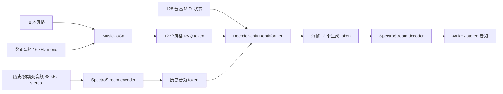

# Magenta RealTime 2 技术参考

更新日期：2026-07-24

本文记录 Magenta RealTime 2（MRT2）的基本结构、实时运行方式，以及它与本项目 DDSP
钢琴模型和 Ascend 310B 部署合同的关系。MRT2 是完整音乐的流式生成模型，不是 DDSP 的
实时版本，也不能直接替换本项目的 v1/v2 模型。

## 本地参考状态

| 项目 | 状态 |
|---|---|
| 上游仓库 | https://github.com/magenta/magenta-realtime |
| 本地目录 | `references/magenta-realtime` |
| 固定提交 | `2a854047691fb96ac024aa01650a702b6cfc5f2e` |
| 分支 | `main`，即 Magenta RealTime 2 |
| v1 位置 | 上游 `v1_legacy` 分支 |
| 本地内容 | 约 12 MB 的浅克隆源码及 `sequence-layers` 子模块 |
| 模型权重 | 未下载；源码目录内没有 `.safetensors`、`.mlxfn` 或 `.tflite` 权重 |

截至更新日期，本地 `main` 与远端 `main` 指向同一提交。仓库目录名称没有附加 `v2`，
但其 README 标题和主分支内容均为 **Magenta RealTime 2**。

MRT2 的代码使用 Apache 2.0，官方模型权重使用 CC BY 4.0，并附带官方使用条款。实际使用
权重前必须重新检查模型卡中的最新许可和条款。

## 模型定位

MRT2 面向低延迟、连续的完整音乐音频生成。它根据历史音频、文本或参考音频表达的风格，
以及可选 MIDI 状态，逐帧采样后续音乐。典型用途是实时即兴、伴奏、音乐续写和交互式创作。

这与本项目的任务不同：本项目根据确定的 MIDI 演奏信息重建钢琴音色，目标是尽量忠实地
保留音高、时值、力度和踏板，而不是自由生成新的配器或音乐内容。

## v2 相对 v1 的主要变化

MRT2 沿用第一版的“音频 codec + 风格编码器 + 音频 token 生成器”思路，主要变化位于
生成器：

- v2 使用 decoder-only Transformer。
- v2 从 chunk-wise 自回归改为 frame-wise 自回归。
- 每个 codec 帧都可以接收风格、MIDI 和历史音频条件，控制粒度更细。
- 模型和运行时针对设备端流式生成进行了调整。

这里的 `RealTime` 指低延迟的生成和交互系统，不表示它是 DDSP 的实时推理实现。

## 系统组成

### SpectroStream

SpectroStream 是离散音频 codec：

- 编码器输入、解码器输出：48 kHz 立体声音频。
- token 帧率：25 Hz，即每帧 40 ms 音频。
- 编码表示：64 层 RVQ、每个 code 10 bit，官方给出的码率为 16 kbps。
- Depthformer 实际每个生成步输出一帧中的 12 个 RVQ token，交给 codec 解码为音频。

### MusicCoCa

MusicCoCa 把文本和音频风格映射到共同空间：

- 输入：描述音乐风格的文本，或 16 kHz 单声道参考音频。
- 输出：768 维风格嵌入。
- 供生成器使用时量化为 12 层、10 bit 的 RVQ token。

### Depthformer

Depthformer 是逐帧生成 SpectroStream token 的 decoder-only Transformer。每个 25 Hz 时间步
接收历史音频 token、12 个风格 token 和 MIDI 状态，并输出一帧 12 个 RVQ token。

MIDI 条件是 128 维 multi-hot 音高状态，每个音高的状态值为：

| 值 | 含义 |
|---:|---|
| 0 | Off |
| 1 | Sustain |
| 2 | Onset |
| 3 | Sustain 或 Onset，由模型决定 |

这是一种音高级状态条件，不等同于本项目固定 16 个复音槽位的
`[pitch, onset_velocity]` 条件，也没有直接替代当前力度、踏板和声部分配合同。

## 规模与上下文

| 配置 | 参数量 | 每层窗口 | 层数 | 官方说明 |
|---|---:|---:|---:|---|
| `mrt2_small` | 230M | 41 帧，约 1.6 秒 | 12 | 可在 Apple Silicon 上实时运行 |
| `mrt2_base` | 2.4B | 25 帧，1 秒 | 20 | 实时运行需要较高端的 Apple Silicon Pro/Max |

两种配置通过逐层窗口形成约 20 秒的有效感受野。模型卡报告约 200 ms 的低延迟交互，
但这是 MRT2 官方软硬件栈的结论，不是本项目服务器、ONNX Runtime 或 Ascend 310B 的实测数据。

## 训练与已公开限制

- 官方模型卡称训练集约为 71,000 小时、主要是器乐的 stock music。
- 训练使用 JAX、Sequence Layers 和 TPU。
- 官方说明监督微调支持仍在后续计划中。
- v2 独立技术报告尚未发布，当前引用的是 2025 年的 *Live Music Models*。
- 模型卡称完整评测指标和结果将在后续技术报告中公布，因此不能只根据“实时”或参数规模
  推断其钢琴保真度优于专用 DDSP-Piano。

## 官方推理与导出路径

| 路径 | 用途 |
|---|---|
| Python JAX | 研究和离线推理，可使用 NVIDIA GPU |
| Python MLX | Apple Silicon 推理和导出 |
| C++ `magentart::core` | Apple Silicon 上的应用、插件和流式音频运行时 |
| MLXFN | Depthformer 和 SpectroStream encoder 的官方 C++ 部署格式 |
| TFLite | MusicCoCa 文本/音频编码资源 |

官方 C++ 运行时使用独立推理线程、立体声环形缓冲、无锁音频回调读取、音量平滑、MIDI gate
和 underrun 处理。其依赖包括 MLX、TFLite 和 SentencePiece，官方实时目标是 macOS 14+
Apple Silicon。

仓库当前没有提供完整系统的 ONNX 导出或 Ascend 310B/CANN 部署合同。因此，源码能够在
NVIDIA GPU 上离线运行，不代表其可以转换为当前项目所需的 FP16/FP32 OM，也不能据此声称
Ascend 兼容。

## 与 DDSP 钢琴模型的区别

| 维度 | 本项目 DDSP 钢琴模型 | Magenta RealTime 2 |
|---|---|---|
| 目标 | MIDI 到确定性钢琴音频 | 连续生成和续写完整音乐 |
| 中间表示 | 幅度、谐波分布、非谐性、噪声等连续参数 | 离散音频 codec token |
| 生成核心 | GRU 神经控制器 + 谐波/噪声/混响 DSP | 自回归 Transformer + SpectroStream codec |
| 控制 | 复音槽位、力度、踏板、钢琴类别 | 文本/音频风格、历史音频、128 音高 MIDI 状态 |
| 输出 | 当前合同为 16 kHz 单声道控制帧，宿主 DSP 合成音频 | 48 kHz 立体声音频 |
| 可解释性 | 合成控制量具有明确物理含义 | token 和采样结果不直接对应物理声学参数 |
| 可重复性 | 固定输入、状态和噪声策略下可以确定性复现 | 自回归采样通常具有随机性 |
| 部署 | FP32 ONNX opset 13 控制器，目标为 Ascend 310B | JAX/MLX/TFLite，官方实时目标为 Apple Silicon |

## 对本项目的借鉴边界

可以优先借鉴且不要求替换 DDSP 主模型的工程设计：

1. 独立推理线程与音频回调之间的无锁 SPSC 环形缓冲。
2. 缓冲欠载、静音、音量平滑、MIDI gate 和状态重置语义。
3. 区分 onset、sustain 和 off 的逐帧 MIDI 状态表达。
4. 预填充、固定上下文状态和逐帧性能统计方法。
5. 将生成模型、codec、风格编码和宿主运行时分成明确的组件边界。

以下内容不能直接进入当前 Ascend ONNX 推理路径：

1. MLXFN、TFLite 或依赖 Metal/Apple Silicon 的运行时。
2. 230M/2.4B Transformer 未经内存、算子和时延验证的整体移植。
3. 动态自回归采样、随机 token 选择和未固定长度的 Python 生成循环。
4. 把 48 kHz 立体声 codec、风格编码器和生成器强行合并到当前单帧 ONNX 图。

当前结论是：DDSP 仍是本项目 MIDI 钢琴合成和 Ascend 310B 部署的主路线；MRT2 是生成能力
与实时宿主工程的参考。如果以后要增加“自动伴奏或风格续写”，应建立独立实验分支和独立
部署合同，而不是把它命名为现有 DDSP-Piano 的下一个小版本。

## 参考入口

- 本地源码：`references/magenta-realtime`
- 本地模型卡：`references/magenta-realtime/MODEL.md`
- 本地模型说明：`references/magenta-realtime/docs/models.md`
- 本地导出说明：`references/magenta-realtime/docs/exporting.md`
- 本地 C++ 运行时说明：`references/magenta-realtime/core/README.md`
- 官方仓库：https://github.com/magenta/magenta-realtime
- 官方模型卡：https://huggingface.co/google/magenta-realtime-2
- Live Music Models：https://arxiv.org/abs/2508.04651
- SpectroStream：https://arxiv.org/abs/2508.05207
- DDSP：https://arxiv.org/abs/2001.04643

